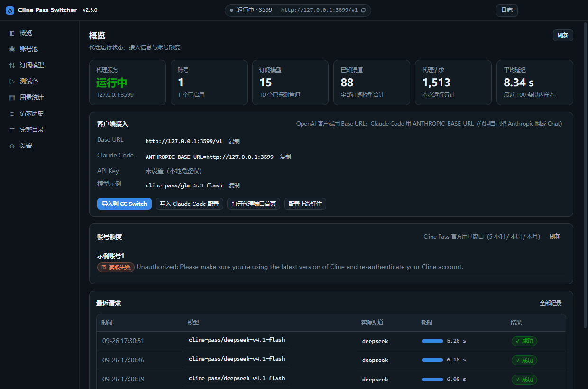
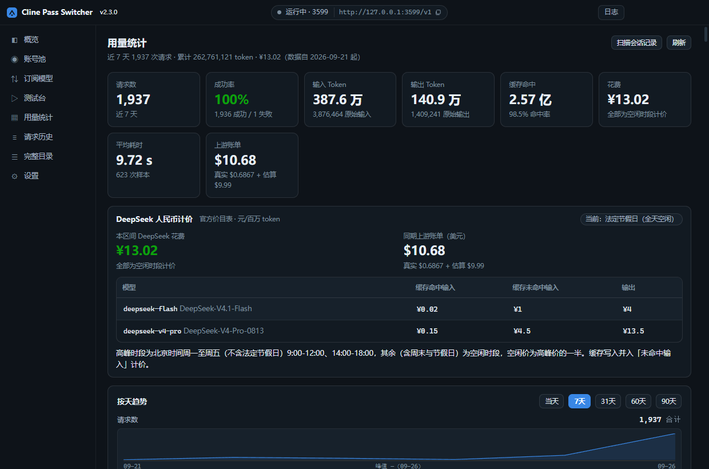

# Cline Pass Switcher — Desktop

[中文](README.md) · [English](README.en.md)

An Electron desktop app for observing and pinning the upstreams behind Cline Pass:
a real window, a tray icon, launch-at-login — no terminal, no commands.

## Screenshots

**Overview** — proxy status, client setup, account quotas:



**Usage** — trends, CNY spend, per-request detail, updating live:



> Demo data; account name and key replaced.

## What it solves

The `provider.*` fields in a `cline-pass/*` request are **dropped** by the Cline gateway, which
then picks an upstream itself. So "which upstream am I actually hitting, can I pin it, is it still
alive?" is invisible from the client side.

| Capability | Description |
|---|---|
| Pipeline detection | Whether a model uses `direct` (OpenRouter) or `planner` (Vercel AI Gateway) |
| Upstream enumeration | Reads the available upstream list from a tiny real request's metadata |
| Ordered pinning | A per-model pin chain tried in order, with automatic failover and an exclude list |
| Pin verification | Pins each upstream once to test real availability, saved as status |
| Account pool | Round-robin or manual, plus official quotas (5-hour / weekly / monthly) |
| Request history | Actual upstream, backing model, latency and account for every request |
| Usage statistics | Token / cache / spend trends (today hourly, 7/31/60/90 days) and detail, live |
| CNY pricing | DeepSeek priced from the official list (peak/off-peak), shown **alongside** USD, never merged |
| Dual protocol | Serves both `/v1/chat/completions` and `/v1/messages`, so Claude Code connects directly |
| Write Claude Code config | One click into `~/.claude/settings.json` (own keys only, backs up, restorable) |
| Bilingual UI | Follows the system language, or set it manually |

## Getting started

**Install**: grab `ClinePassSwitcher-Setup-<version>.exe` (installer) or
`-Portable-<version>.exe` (single file) from
[Releases](https://github.com/lnsane/cline-pass-switcher-desktop/releases).
On first launch, add your Cline Pass API key (starts with `sk_`) in **Accounts** and save.

> The installers are **not code-signed**. With Smart App Control enabled, Windows blocks the
> installer — use the portable build instead.

**From source**:

```bash
npm install
npm run dev          # launch the window
```

**Build locally** (faster than packaging, unaffected by signing):

```bat
scripts\build-win.bat        :: Windows, double-clickable
```
```bash
bash scripts/build-mac.sh    # macOS
```

Both take `--clean` (wipe `dist/` first) and `--run` (launch when done). Each script only builds
for its own platform — push a tag to let CI build the other one.

## Client setup

| Client | Value |
|---|---|
| OpenAI-compatible | Base URL `http://127.0.0.1:3199/v1` |
| Claude Code | `ANTHROPIC_BASE_URL=http://127.0.0.1:3199` |

Use the model name as-is: `cline-pass/xxx`. Both protocols support tool calling and streaming.

## Usage statistics

Two sources, deduplicated by request id and merged — so **stats work even with the proxy off**:

| Source | Spend |
|---|---|
| Requests through this proxy | The **real upstream invoice** |
| Imported from Claude Code sessions | Pricing-table estimate (marked "est") |

DeepSeek models are additionally priced from the **official CNY list** (CNY per million tokens):

| Model | Cached input | Uncached input | Output |
|---|---|---|---|
| `deepseek-flash` | 0.02 / 0.04 | 1 / 2 | 4 / 8 |
| `deepseek-v4-pro` | 0.15 / 0.30 | 4.5 / 9.0 | 13.5 / 27.0 |

Each cell is **off-peak / peak**. Peak is Mon–Fri 09:00–12:00 and 14:00–18:00 Beijing time,
excluding Chinese public holidays; everything else is off-peak, at **exactly half** the peak rate.

Two things worth being explicit about:

- **The currencies are never merged.** CNY comes from the official list and is independent of which
  upstream served the request; USD is the real invoice. Adding or converting them would produce a
  number carrying a hidden FX assumption.
- Only DeepSeek has an official CNY price. Other models (k3 / glm / qwen …) stay "no CNY price"
  rather than being given someone else's rate and passing for ¥0.

> Older records showing ¥0 is expected — CNY pricing was added later. Click **Recalculate CNY** in
> the detail panel to price the whole history from the official table (idempotent).

## Write Claude Code config

Available in **Overview → Client setup** and **Settings → Data**. It merges this proxy into
`~/.claude/settings.json`:

- Touches only its own keys, leaves everything else alone; backs up first, restorable in one click
- Context window: **200K (default) / 1M**. Choosing 1M writes
  `CLAUDE_CODE_MAX_CONTEXT_TOKENS=1000000`; switching back to 200K **actually deletes the key**
  (a merge can't delete, so without an explicit delete you'd see "changed" but nothing would change)
- The UI validates your choice against the real window it measured from the upstream — picking a
  window larger than the upstream supports gets rejected upstream
- Restart Claude Code (or start a new session) for changes to take effect

## Testing

```bash
npm run test:unit          # protocol translation state machine
npm run test:usage         # usage statistics core
npm run test:cny           # DeepSeek CNY pricing (incl. cross-timezone)
npm run test:usage-offline # usage end-to-end (fully offline)
npm run test:claudecfg     # config write / backup / restore
npm run test:context       # context-window tiers
npm run test:i18n          # bilingual coverage
```

Tests needing a real account key (`test:live` / `test:e2e` / `test:usage-live`) are **never** wired
into CI; run them locally with `BASE=` and `KEY=`.

## Known limitations

- **Port conflict**: defaults to `3123`, same as the CLI version. Running both means one must change
  ports. The engine **never kills** whatever holds a port — it reports `EADDRINUSE` and asks you to
  pick another.
- **Unsigned**: Smart App Control blocks the Windows installer (use the portable build); macOS
  Gatekeeper blocks first launch (right-click → Open, or `xattr -cr`).
- **Binds `127.0.0.1` only**: not exposed to the LAN; put a reverse proxy in front if you need that.

## License

MIT.
